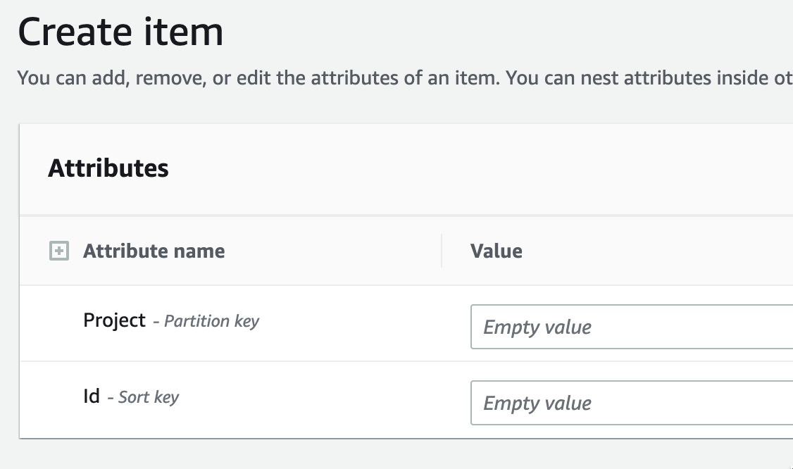
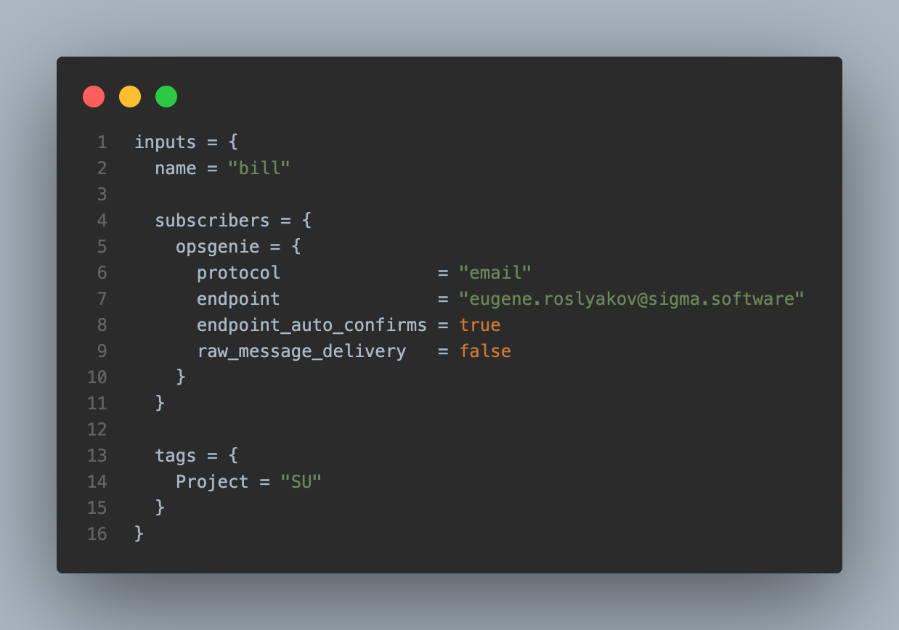

## AWS Lambda for getting the bill report

## How to use.

To use it, a DevOps engineer needs to apply the CloudFormation template that creates an IAM role that grants access to the billing from the root AWS account (use id as variable AccID).

The lambda assumes the role _‘su-get-bill-data-access’_ and gets a bill once per month.

To add a new project to control the AWS bill, we need to add a new item in the DynamoDB table (the table creates during the first run and has the name su-bill-report-{year})



Each time when the Lambda runs creates an excel report and saves  to the S3 bucket (the bucket name provides through env variables _S3_BUCKET_NAME_ and path through _S3_BUCKET_KEY_).

As well, Lambda sends notifications to the SNS topic that creates through IaC (Infra folder)
The messages consist off:

- report status with presigned URL for downloading excel report
- information about growing the bill (up to 10%)

To add a new member to the SNS topic, please add a new item to the subscribers’ variable




## Local using

### to get the current month bill (you have to provide the source table --table-name, if it is not provided, will use su-bill-report-{year}) 
```
python3 ./lambda_function.py
```
### for specific month
```
python3 ./lambda_function.py --month 02
```
### Script arguments
| Name         | Description                                       | Default    |
|--------------|---------------------------------------------------|------------|
| `--profile`  | AWS profile to get access to assume role  | default  (only local run)  |
| `--month`    | The report will be created for this month         | current (only local run)  |
| `--year`     | The report will be created for this year          | current (only local run) |
| `--sns-topic-arn`     | The S3 bucket to save the report          | OS env SNS_TOPIC_ARN default: ""|
| `--bucket-name`     | The S3 bucket to save the report          | OS env S3_BUCKET_NAME default: rei-data|
| `--bucket-key`     | The S3 bucket key to save the report          | OS env S3_BUCKET_KEY default: bill_report|
| `--table-name`     | The DynamoDB table name to save data         | OS env DYNAMODB_TABLE default: su-bill-report-{year}|
